# FinSight AI: Technical Flow

This diagram describes the implemented backend path. It distinguishes the
deterministic financial investigation from the optional external LLM call.

```mermaid
flowchart TB
    CLIENT["Operations analyst / reviewer<br/>Swagger or API client"]

    subgraph API["FastAPI routes: app/api/routes; Pydantic request/response schemas"]
        TOKEN_API["POST /auth/token"]
        USER_API["POST /auth/users (administrator)"]
        INVEST_API["POST /investigations/settlements/{settlement_id}<br/>GET /investigations/?filters<br/>GET /investigations/{investigation_id}"]
        AI_API["POST /ai/investigations/{investigation_id}/explanation"]
        APPROVAL_API["GET /investigations/{id}/approval-events<br/>POST /investigations/{id}/submit-for-approval<br/>POST /investigations/{id}/decision"]
        HEALTH_API["GET /health"]
        LEGACY_API["PUT /investigations/{id}/<br/>Deprecated; returns 409"]
    end

    subgraph SECURITY["Security layer"]
        LOGIN["OAuth2 form login<br/>verify password; issue JWT"]
        USER_CREATE["UserService + UserRepository<br/>create user; map role"]
        JWT["Bearer JWT validation<br/>load active user from PostgreSQL"]
        RBAC["require_roles<br/>ANALYST / REVIEWER / ADMINISTRATOR"]
    end

    subgraph INVESTIGATION["Deterministic investigation layers"]
        APP_SERVICE["InvestigationApplicationService<br/>idempotency lookup; transaction boundary"]
        RECON["ReconciliationService<br/>sum completed credits/debits; compare Decimal amounts"]
        BUILD_CONTEXT["InvestigationService<br/>load settlement, transaction, order,<br/>executions, and cash movements"]
        ENGINE["InvestigationEngine<br/>rule-based root causes, impact, severity,<br/>evidence, and recommended action"]
        PERSIST["Case / finding / evidence repositories<br/>commit together; rollback on failure"]
    end

    subgraph AI_FLOW["Explanation and RAG layers"]
        AGENT["InvestigationExplanationAgent<br/>fixed, read-only tool sequence"]
        READ_TOOLS["InvestigationReadOnlyTools<br/>read investigation and linked financial records"]
        POLICY_SEARCH["PolicyRepository<br/>PostgreSQL English full-text + keyword search<br/>approved, active, effective chunks only"]
        CONTEXT["InvestigationExplanationContext<br/>finding + source records + retrieved policy chunks"]
        PROVIDER_SELECT{"AI_PROVIDER"}
        MOCK["DeterministicExplanationProvider<br/>local predictable response"]
        LLM["LLMExplanationProvider<br/>JSON request to configured external endpoint"]
        VALIDATE["Validate response fields and confidence<br/>accept only retrieved policy citations<br/>retain database evidence as authoritative"]
        AUDIT["AIExplanationAuditRepository<br/>separate PostgreSQL connection<br/>input snapshot/hash, output or safe failure category"]
    end

    subgraph APPROVAL["Human approval layers"]
        APPROVAL_SERVICE["InvestigationApprovalService"]
        APPROVAL_REPO["InvestigationApprovalRepository<br/>FOR UPDATE; validate transition;<br/>update case + append event atomically"]
        TRANSITIONS["OPEN / INVESTIGATING<br/>-> PENDING_APPROVAL<br/>-> APPROVED / REJECTED<br/>or REQUEST_CHANGES -> INVESTIGATING"]
    end

    subgraph DATA["PostgreSQL: 4 schemas, 22 tables"]
        AUTH_DB["authentication<br/>users, roles, permissions,<br/>user_role_mappings"]
        FIN_DB["financial<br/>customers, accounts, portfolios, securities,<br/>holdings, orders, executions, transactions,<br/>execution_transactions, settlements, cash_movements"]
        INV_DB["investigation<br/>cases, findings, evidence, approval_events"]
        AI_DB["ai<br/>policy_documents, policy_chunks, explanation_runs"]
    end

    UVICORN["Uvicorn ASGI server"]
    LOGGING["Central logging<br/>console + logs/finsight-ai.log<br/>rotating file handler"]
    LLM_SERVICE["External configured LLM service<br/>model inference runs outside FinSight"]

    CLIENT --> UVICORN
    UVICORN --> TOKEN_API
    UVICORN --> USER_API
    UVICORN --> INVEST_API
    UVICORN --> AI_API
    UVICORN --> APPROVAL_API
    UVICORN --> HEALTH_API
    UVICORN --> LEGACY_API
    TOKEN_API --> LOGIN
    USER_API --> JWT
    RBAC --> USER_CREATE
    LOGIN --> AUTH_DB
    USER_CREATE --> AUTH_DB

    INVEST_API --> JWT
    AI_API --> JWT
    APPROVAL_API --> JWT
    LEGACY_API --> JWT
    JWT --> RBAC
    RBAC --> APP_SERVICE
    RBAC --> AGENT
    RBAC --> APPROVAL_SERVICE
    RBAC --> LEGACY_API

    APP_SERVICE --> RECON
    RECON --> FIN_DB
    RECON -->|match: no case created| INVEST_API
    RECON -->|mismatch| BUILD_CONTEXT
    BUILD_CONTEXT --> FIN_DB
    BUILD_CONTEXT --> ENGINE
    ENGINE --> PERSIST
    PERSIST --> INV_DB
    APP_SERVICE --> INVEST_API

    AI_API --> AGENT
    AGENT --> READ_TOOLS
    READ_TOOLS --> INV_DB
    READ_TOOLS --> FIN_DB
    AGENT --> POLICY_SEARCH
    POLICY_SEARCH --> AI_DB
    READ_TOOLS --> CONTEXT
    POLICY_SEARCH --> CONTEXT
    CONTEXT --> PROVIDER_SELECT
    PROVIDER_SELECT -->|mock| MOCK
    PROVIDER_SELECT -->|llm| LLM
    LLM --> LLM_SERVICE
    LLM_SERVICE --> LLM
    MOCK --> VALIDATE
    LLM --> VALIDATE
    VALIDATE --> AUDIT
    AUDIT --> AI_DB
    VALIDATE --> AI_API
    AI_API -. failure traceback .-> LOGGING
    AGENT -. audit-write failure .-> LOGGING

    APPROVAL_API --> APPROVAL_SERVICE
    APPROVAL_SERVICE --> APPROVAL_REPO
    APPROVAL_REPO --> INV_DB
    APPROVAL_REPO --> AI_DB
    APPROVAL_REPO --> TRANSITIONS

    HEALTH_API --> CLIENT
    LEGACY_API -->|409: direct status changes blocked| CLIENT

    classDef external fill:#fff4df,stroke:#bd7411,color:#263238;
    classDef ai fill:#e8f5f2,stroke:#0f766e,color:#163c39;
    classDef api fill:#eaf1fb,stroke:#315f9b,color:#1c3554;
    classDef db fill:#f2eef9,stroke:#69519a,color:#302349;
    classDef ops fill:#f1f5f6,stroke:#647781,color:#223640;
    class LLM_SERVICE external;
    class AGENT,READ_TOOLS,POLICY_SEARCH,CONTEXT,PROVIDER_SELECT,MOCK,LLM,VALIDATE,AUDIT ai;
    class TOKEN_API,USER_API,INVEST_API,AI_API,APPROVAL_API,HEALTH_API,LEGACY_API api;
    class AUTH_DB,FIN_DB,INV_DB,AI_DB db;
    class UVICORN,LOGGING ops;
```

## API inventory

| Method and path | Purpose | Access |
|---|---|---|
| `GET /health` | Liveness check | Public |
| `POST /auth/token` | Verify credentials and issue a JWT | Public |
| `POST /auth/users` | Create a user and assign a role | Administrator |
| `POST /investigations/settlements/{settlement_id}` | Reconcile and investigate a settlement mismatch | Analyst, reviewer, administrator |
| `GET /investigations/` | List investigations; supports settlement, status, severity, and type filters | Analyst, reviewer, administrator |
| `GET /investigations/{investigation_id}` | Read case, amounts, status, and finding | Analyst, reviewer, administrator |
| `PUT /investigations/{investigation_id}/` | Legacy direct status change; deliberately returns `409` | Reviewer, administrator |
| `POST /ai/investigations/{investigation_id}/explanation` | Gather records, retrieve policy, explain, and audit | Analyst, reviewer, administrator |
| `GET /investigations/{investigation_id}/approval-events` | Read append-only approval history | Analyst, reviewer, administrator |
| `POST /investigations/{investigation_id}/submit-for-approval` | Submit case and optional successful AI run for review | Analyst, reviewer, administrator |
| `POST /investigations/{investigation_id}/decision` | Approve, reject, or request changes | Reviewer, administrator |

## Important runtime distinctions

- Reconciliation and root-cause classification are deterministic Python rules; they are not an ML model.
- The agent calls its database tools in a fixed Python-defined sequence. The LLM does not choose arbitrary tools or query the database itself.
- RAG is PostgreSQL full-text plus curated-keyword search. The returned approved policy chunks are added to the provider context and included in the AI audit snapshot.
- `AI_PROVIDER=mock` skips external inference. `AI_PROVIDER=llm` sends the assembled JSON context to the configured external service.
- Current policy examples are demonstration content, not business-approved or regulatory guidance.
- The approval event migration must exist before approval routes are used. The AI audit and policy tables must exist before the explanation route is used.