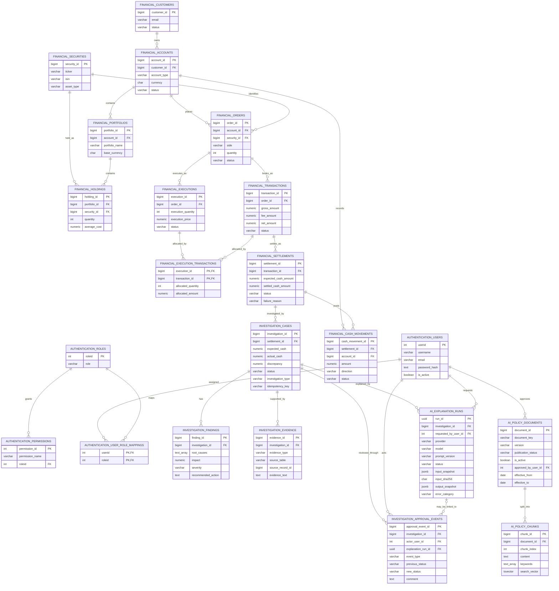

# FinSight AI: Database Design and Data Flow

This ERD reflects the tables and declared primary/foreign keys observed in the
configured PostgreSQL database. It includes the full `authentication`,
`financial`, `investigation`, and `ai` application schemas, not only the tables
used by one API request.

## How data moves through the database

1. **Financial source records** are connected by foreign keys from customer to
   account, order, execution/transaction, settlement, and cash movement. The
   broader portfolio domain also includes securities, portfolios, and
   holdings. `execution_transactions` is a composite-key allocation bridge.
2. **Reconciliation** reads a settlement and its cash movements. If expected
   and actual amounts differ, the application creates an
   `investigation.cases` row, one deterministic finding, and evidence rows.
3. **Explanation/RAG** reads the case, finding, evidence, and linked financial
   records. It retrieves only approved, active, currently effective policy
   chunks. One `ai.explanation_runs` row records each successful or failed
   provider attempt, including the input snapshot/hash and structured output
   or safe error category.
4. **Human review** moves a case from `OPEN` or `INVESTIGATING` to
   `PENDING_APPROVAL`, then to `APPROVED`, `REJECTED`, or back to
   `INVESTIGATING` for changes. The case status update and
   `investigation.approval_events` insert happen in one transaction.

## Relationship and scope notes

- The ERD draws declared database foreign keys. `investigation.evidence`
  stores `source_table` plus `source_record_id` as a polymorphic reference;
  PostgreSQL does not enforce that reference as an FK.
- `authentication.permissions` is related to roles in the database and seeded,
  but current API authorization checks the role value directly rather than
  evaluating permission rows dynamically.
- The financial, authentication, and initial investigation schemas are
  provisioned separately from the AI/approval migrations checked into this
  repository. The ERD reflects the configured live database catalog.