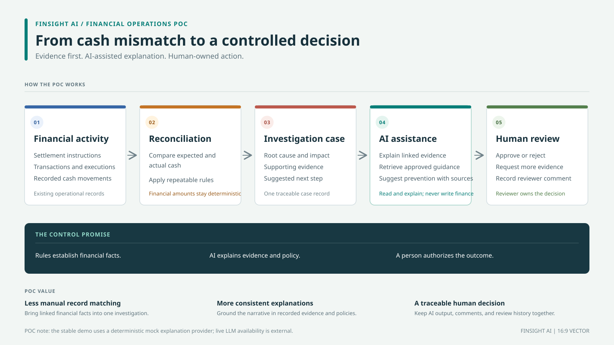

# FinSight AI: POC Functional Flow

This is the stakeholder-facing version. It focuses on the operational problem
and the value FinSight is intended to provide, not backend implementation
details.

```mermaid
flowchart LR
    OPS["Operations team<br/>investigates a cash mismatch"]
    RECORDS["Financial activity<br/>settlement, transaction,<br/>execution, cash movement"]
    CHECK["FinSight checks<br/>expected cash vs actual cash"]
    MISMATCH{"Do the amounts match?"}
    CASE["Investigation case<br/>cause, impact, evidence"]
    AI["AI-assisted explanation<br/>plain-language summary<br/>approved policy guidance"]
    REVIEW["Human review<br/>approve / reject / request changes"]
    TRACE["Traceable outcome<br/>case status + review history"]
    MATCH["No discrepancy case<br/>normal reconciliation result"]

    OPS --> RECORDS --> CHECK --> MISMATCH
    MISMATCH -->|Yes| MATCH
    MISMATCH -->|No| CASE --> AI --> REVIEW --> TRACE

    classDef work fill:#eaf1fb,stroke:#315f9b,color:#1c3554;
    classDef assist fill:#e8f5f2,stroke:#0f766e,color:#163c39;
    classDef person fill:#fff3df,stroke:#bd7411,color:#563b15;
    classDef outcome fill:#edf5ec,stroke:#54804c,color:#294529;
    class OPS,RECORDS,CHECK,CASE work;
    class AI assist;
    class REVIEW person;
    class TRACE,MATCH outcome;
```

## POC value

- **Less manual comparison:** expected cash and recorded cash movements are
  reconciled consistently.
- **Faster case understanding:** the user sees a structured finding and can
  request a plain-language explanation instead of joining every record by
  hand.
- **More consistent investigation:** each case keeps its discrepancy, cause,
  impact, and evidence together.
- **Policy-informed prevention:** when a real LLM is available, retrieved
  approved policy chunks can ground preventive suggestions and citations.
- **Human accountability:** a reviewer owns the approval decision; AI does not
  change financial records.

## Demo status

For a stable demo, `AI_PROVIDER=mock` is currently used. It demonstrates the
workflow and policy retrieval but returns deterministic explanation text. The
real LLM provider is configurable; recent live Gemini requests have returned
intermittent `503` responses. The SVG companion is a 16:9 vector image that
can be inserted into PowerPoint using **Insert > Pictures**.

