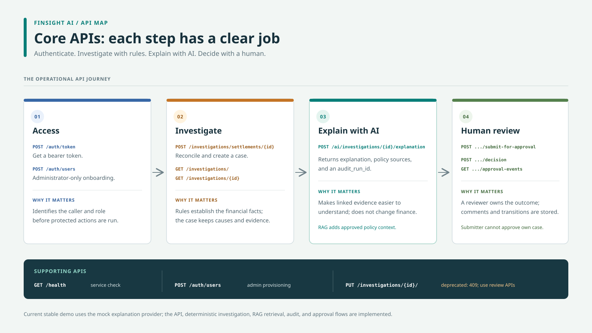

# FinSight AI: Core APIs and Why They Matter

The primary API journey turns raw financial activity into an evidence-backed
case, an explanation, and a human decision.

```mermaid
flowchart LR
    USER["Operations user"]
    AUTH["POST /auth/token<br/><b>Authenticate</b><br/>Returns a bearer token"]
    CREATE["POST /investigations/settlements/{settlement_id}<br/><b>Investigate</b><br/>Reconcile cash; create a finding when mismatched"]
    READ["GET /investigations/<br/>GET /investigations/{investigation_id}<br/><b>Find and inspect</b><br/>Filter cases; review evidence and status"]
    EXPLAIN["POST /ai/investigations/{investigation_id}/explanation<br/><b>Explain</b><br/>Read linked records; retrieve approved policy; audit the result"]
    SUBMIT["POST /investigations/{investigation_id}/submit-for-approval<br/><b>Request review</b><br/>Optionally link the AI audit_run_id"]
    DECIDE["POST /investigations/{investigation_id}/decision<br/><b>Reviewer decision</b><br/>Approve, reject, or request changes"]
    HISTORY["GET /investigations/{investigation_id}/approval-events<br/><b>Trace the decision</b><br/>Read the append-only review history"]
        USER --> AUTH --> CREATE --> READ --> EXPLAIN --> SUBMIT --> DECIDE --> HISTORY

        classDef identity fill:#eaf1fb,stroke:#315f9b,color:#1c3554;
        classDef core fill:#fff3df,stroke:#bd7411,color:#563b15;
        classDef ai fill:#e8f5f2,stroke:#0f766e,color:#163c39;
        classDef control fill:#edf5ec,stroke:#54804c,color:#294529;
        class AUTH identity;
        class CREATE,READ core;
        class EXPLAIN ai;
        class SUBMIT,DECIDE,HISTORY control;
```

## Endpoint importance

| API | Who can use it | Why it matters |
|---|---|---|
| `POST /auth/token` | Public login; credentials are validated | Establishes the user's identity and returns a bearer token required by protected routes. |
| `POST /auth/users` | Administrator | Onboards users and assigns an application role. |
| `POST /investigations/settlements/{settlement_id}` | Analyst, reviewer, administrator | Runs deterministic reconciliation and creates a persisted case, finding, and evidence when cash differs. An idempotency key prevents duplicate cases on a repeated request. |
| `GET /investigations/` | Analyst, reviewer, administrator | Lets an operations user find and prioritize cases using settlement, status, severity, or type filters. |
| `GET /investigations/{investigation_id}` | Analyst, reviewer, administrator | Shows the case amounts, discrepancy, current status, and stored finding/evidence. |
| `POST /ai/investigations/{investigation_id}/explanation` | Analyst, reviewer, administrator | Calls the bounded explanation agent. It reads linked records, retrieves approved policy chunks, returns a structured explanation with citations and an `audit_run_id`, and records the attempt in PostgreSQL. |
| `POST /investigations/{investigation_id}/submit-for-approval` | Analyst, reviewer, administrator | Records who submitted the case, a required comment, and optionally the successful AI run being reviewed. |
| `POST /investigations/{investigation_id}/decision` | Reviewer, administrator | Records an approval, rejection, or request for changes. A submitter cannot approve their own submission. |
| `GET /investigations/{investigation_id}/approval-events` | Analyst, reviewer, administrator | Makes the case's submission and decision history inspectable. |
| `GET /health` | Public | Provides a simple service-liveness check for local development or monitoring. |
| `PUT /investigations/{investigation_id}/` | Reviewer, administrator; deprecated | Returns `409`; direct status changes are blocked so status transitions cannot bypass the approval audit trail. |

## Role in the workflow

- **Authentication APIs** establish who is calling. Role checks protect each
    operational action.
- **Investigation APIs** are the system-of-record workflow: reconciliation and
    root-cause classification are deterministic Python logic.
- **AI explanation API** is advisory. The agent reads financial records and
    approved policy context; it does not update financial records.
- **Approval APIs** keep the final operational decision with a different
    authorized human and store the transition history in PostgreSQL.

## Demo order

For a short Swagger walkthrough, authenticate with `/auth/token`, find a case
with `GET /investigations/`, inspect it with `GET /investigations/{id}`, request
an explanation, submit its returned `audit_run_id` for review, make a reviewer
decision, and display the approval events. The stable demo currently uses the
mock provider; the endpoint and agent workflow still demonstrate API
orchestration and audit/RAG integration.

